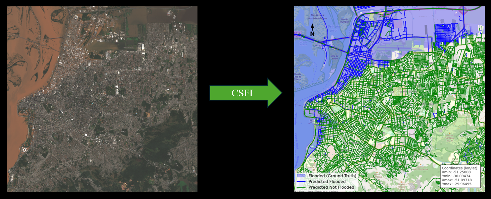

# Custom Street Flood Index (CSFI)

The Custom Street Flood Index model is a new architecture designed to detect flooded streets. It takes optical remote sensing images as an input and outputs predictions for each street. The repository aims at making this new tool fully acccessible to everybody.

  

## Quick guide

To run the model, simply use the src/main.py file

You just need to input : 
- The path to the scene of the flooded area
- The path to the scene before the flood (preferably same month other year)

Those can be tif files or .SAFE from Copernicus

Once this is done, you can visualize the results with the notebook src/visualize_results.ipynb

## More details 

Here are some more details about using our model :

To install the package, run `pip install .`

The code was written and tested with python 3.12.10

If you use tif files :
- Reflectance should be between 0 and 1
- The tif file should have 4 bands : Blue, Green, Red and NIR
- Mask clouds with nan if you don't want to include clouded regions

If you use SAFE files :
- It is important to include the extent you want to cover, otherwise the process of extracting the streets and creating the dataset will be very slow
- Extent should be a geojson extent (Example : {"type":"Polygon","coordinates":[[[-51.097183,-29.964949],[-51.250076,-29.964949],[-51.250076,-30.09474],[-51.097183,-30.09474],[-51.097183,-29.964949]]]}). Coordinates should be in lat lon.

